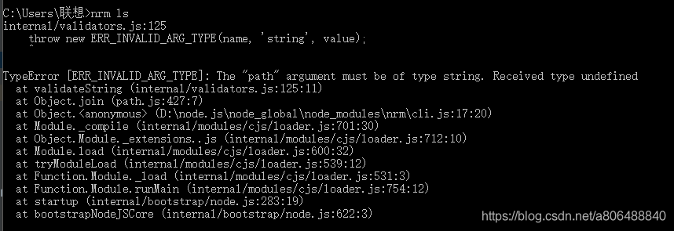
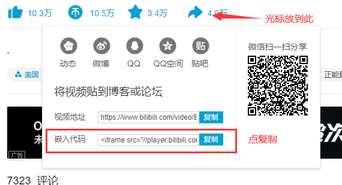

# Gitbook书籍演示
***

>[!NOTE|labelVisibility:hidden|iconVisibility:hidden]
>本操作手册由[Markdowm](https://www.runoob.com/markdown/md-link.html)编写而成并使用gitbook打包,本书为演示环境教程还不完整,会持续更新,敬请期待!
>由于部署在GitHub访问速度可能比较慢!

## 使用教程

### 安装node.js

* 使用nvm安装node,下载 [nvm-windows](https://gitee.com/llhhtt/nvm-windows/releases)最新安装包，直接安装即可。

下载指定的node.js版本
```bash
nvm install 12.17.0
```

查看下载的版本
```bash
nvm ls
```

使用相关版本
```bash
nvm use 12.17.0
```

查看node版本
```bash
node -v
```

查看npm版本
```bash
npm -v
```

* npm加速

使用nrm管理npm镜像源
```bash
npm install -g nrm
```

查看能使用的镜像源
```bash
nrm ls

  npm -------- https://registry.npmjs.org/
  yarn ------- https://registry.yarnpkg.com/
* cnpm ------- http://r.cnpmjs.org/
  taobao ----- https://registry.npm.taobao.org/
  nj --------- https://registry.nodejitsu.com/
  npmMirror -- https://skimdb.npmjs.com/registry/
  edunpm ----- http://registry.enpmjs.org/
```

使用cnpm或taobao镜像
```bash
nrm use cnpm
```

>[!WARNING]
>使用nrm可能遇到的问题



找到报错的文件的路径


找到
```bash
const NRMRC = path.join(process.env.HOME, '.nrmrc');
```
改成
```bash
const NRMRC = path.join(process.env.USERPROFILE, '.nrmrc');
```

### 安装gitbook

使用npm下载
```bash
npm install gitbook-cli -g
```

查看npm版本
```bash
gitbook -V
```

生成目录
```bash
$ gitbook init
warn: no summary file in this book
info: create README.md
info: create SUMMARY.md
info: initialization is finished
```

使用 *$ gitbook serve* 命令,然后在浏览器地址栏中输入 http://localhost:4000 便可预览书籍。

使用 *--lrport* , *--port* 更改监听端口
```bash
gitbook --lrport 35731 --port 4002 serve
```

* book.json

该文件主要用来存放配置信息
```json
{
    "title": "Demo演示",
    "author": "LiuHaitang",
    "description": "kubernetes",
    "language": "zh-hans",
    "gitbook": "3.2.3",
    "styles": {
        "website": "./style/website.css"
    },
    "structure": {
        "readme": "README.md"
    },
    "links": {
        "sidebar": {
            "仓库地址": "https://gitee.com/llhhtt"
        }
    },
    "pdf": {
        "fontSize": 12,
        "footerTemplate": null,
        "headerTemplate": null,
        "margin": {
            "bottom": 36,
            "left": 62,
            "right": 62,
            "top": 36
        },
        "pageNumbers": false,
        "paperSize": "a4"
    },
    "plugins": [
        "klipse",
        "musicxml",
        "include-csv",
        "flexible-alerts",
        "simple-page-toc",
        "prism-themes",
        "prism",
        "back-to-top-button",
        "theme-comscore",
        "multipart",
        "mermaid-gb3",
        "anchors",
        "auto-scroll-table",
        "chapter-fold",
        "expandable-chapters-small",
        "toggle-chapters",
        "advanced-emoji",
        "code",
        "favicon",
        "fontsettings",
        "klipse",
        "-livereload",
        "-lunr",
        "pageview-count",
        "page-toc-button",
        "lightbox",
        "sharing-plus",
        "-sharing",
        "splitter",
        "-search",
        "search-pro",
        "tbfed-pagefooter",
        "hide-element"
    ],
    "pluginsConfig": {
        "simple-page-toc": {
            "maxDepth": 3,
            "skipFirstH1": true
        },
        "prism": {
            "css": [
                "prismjs/themes/prism-solarizedlight.css"
            ]
        },
        "hide-element": {
            "elements": [
                ".gitbook-link"
            ]
        },
        "theme-default": {
            "showLevel": true
        },
        "code": {
            "copyButtons": true
        },
        "tbfed-pagefooter": {
            "copyright": "Copyright © LiuHaitang 2021",
            "modify_label": "本书发布时间：",
            "modify_format": "YYYY-MM-DD HH:mm:ss"
        },
        "page-toc-button": {
            "maxTocDepth": 2,
            "minTocSize": 2
        },
        "sharing": {
            "douban": false,
            "facebook": false,
            "google": false,
            "hatenaBookmark": false,
            "instapaper": false,
            "line": false,
            "linkedin": false,
            "messenger": false,
            "pocket": false,
            "qq": true,
            "qzone": true,
            "stumbleupon": false,
            "twitter": false,
            "viber": false,
            "vk": false,
            "weibo": true,
            "whatsapp": false,
            "all": [
                "weibo",
                "qq",
                "qzone",
                "douban",
                "facebook",
                "google",
                "linkedin",
                "twitter",
                "whatsapp"
            ]
        },
        "anchor-navigation-ex": {
            "isRewritePageTitle": true,
            "isShowTocTitleIcon": true,
            "tocLevel1Icon": "fa fa-hand-o-right",
            "tocLevel2Icon": "fa fa-hand-o-right",
            "tocLevel3Icon": "fa fa-hand-o-right"
        },
        "favicon": {
            "shortcut": "assets/icon/favicon.ico",
            "bookmark": "assets/icon/favicon.ico",
            "appleTouch": "assets/images/logo.png",
            "appleTouchMore": {
                "120x120": "assets/images/logo.png",
                "180x180": "assets/images/logo.png"
            }
        }
    }
}
```

使用 *gitbook install* 安装配置文件中的插件

>[!NOTE|labelVisibility:hidden|iconVisibility:hidden]
>相关文档请参考: [gitbook常用插件](https://www.jianshu.com/p/427b8bb066e6)

## 插入视频

### 嵌入了B站视频

看完后感慨万千,视频类容不能全信,请理性看待.

<iframe src="//player.bilibili.com/player.html?aid=715256534&bvid=BV1xQ4y1Z7dV&cid=331820331&page=1" scrolling="no" border="0" frameborder="no" framespacing="0" allowfullscreen="true" width=100% height=400> </iframe>

>[!NOTE|labelVisibility:hidden|iconVisibility:hidden]
>相关操作

